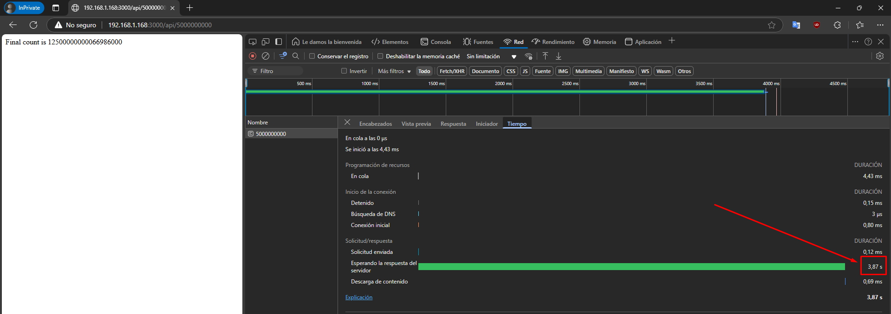
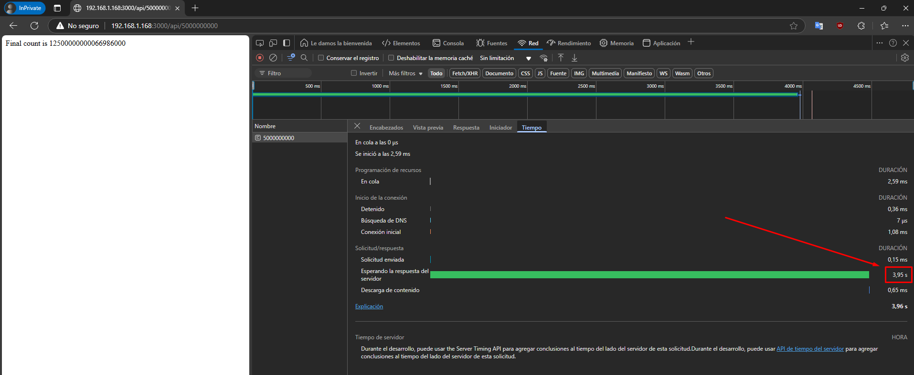

# VAGRANT Y NODE.js: Configuración de Entorno con Express

<hr style="border-radius: 10px;">

## Comandos de Instalación

Estos comandos se utilizan para configurar un entorno de desarrollo en una máquina virtual basada en Debian Bullseye con Node.js, Express y herramientas adicionales como PM2 y Loadtest.

1. **Actualizar la lista de paquetes:**
    ```sh
    apt-get update -y
    ```
    Este comando actualiza la lista de paquetes disponibles y sus versiones.

2. **Instalar Curl:**
    ```sh
    apt-get install curl -y
    ```
    Instala `curl`, una herramienta necesaria para descargar archivos y paquetes desde la web.

3. **Instalar Node.js:**
    ```sh
    curl -fsSL https://deb.nodesource.com/setup_current.x | sudo -E bash -
    apt-get install nodejs -y
    ```
    Este comando descarga el instalador de Node.js y lo configura en la máquina.

4. **Instalar paquetes adicionales:**
    ```sh
    npm install express
    npm install -g loadtest
    npm install pm2 -g
    ```
    Instala el framework `Express`, la herramienta de carga `loadtest` y el gestor de procesos `PM2` de manera global.

## Configuración del Servidor

1. **Crear el directorio para el proyecto y configurar Express:**
    ```sh
    mkdir /home/vagrant/express
    cd /home/vagrant/express
    npm init -y
    cp /vagrant/config/express-sin-cluster.js /home/vagrant/express
    cp /vagrant/config/express-con-cluster.js /home/vagrant/express
    ```
    Se crea un nuevo proyecto Node.js y se copian los archivos de configuración para Express con y sin clúster.

2. **Ejecutar el servidor con Node.js:**
    ```sh
    node /home/vagrant/express/express-sin-cluster.js
    node /home/vagrant/express/express-con-cluster.js
    ```
    Estos comandos arrancan el servidor Express en modo sencillo o con clúster, dependiendo de la configuración.

### Comprobaciones

1. **Verificar el funcionamiento del servidor:**
    Acceder a `http://<ip-mv>:3000/api/<num>` en el navegador para verificar que el servidor de Express está corriendo correctamente.
    - Sin cluster:
    
    - Con cluster:
    

2. **Probar las métricas de rendimiento con Loadtest:**
    ```sh
    loadtest http://localhost:3000/api/500000 -n 1000 -c 100
    ```
    - Sin cluster:
    ```sh
    vagrant@CLUSTER:~/express$     loadtest http://localhost:3000/api/500000 -n 1000 -c 100
    (node:7605) [DEP0060] DeprecationWarning: The `util._extend` API is deprecated. Please use Object.assign() instead.
    (Use `node --trace-deprecation ...` to show where the warning was created)

    Target URL:          http://localhost:3000/api/500000
    Max requests:        1000
    Concurrent clients:  100
    Agent:               none

    Completed requests:  1000
    Total errors:        0
    Total time:          1.024 s
    Mean latency:        96.1 ms
    Effective rps:       977

    Percentage of requests served within a certain time
    50%      106 ms
    90%      122 ms
    95%      125 ms
    99%      138 ms
    100%      149 ms (longest request)
    vagrant@CLUSTER:~/express$ 
    ```
    - Con cluster:
    ```sh
    vagrant@CLUSTER:~/express$ loadtest http://localhost:3000/api/500000 -n 1000 -c 100
    (node:7641) [DEP0060] DeprecationWarning: The `util._extend` API is deprecated. Please use Object.assign() instead.
    (Use `node --trace-deprecation ...` to show where the warning was created)

    Target URL:          http://localhost:3000/api/500000
    Max requests:        1000
    Concurrent clients:  100
    Agent:               none

    Completed requests:  1000
    Total errors:        0
    Total time:          1.02 s
    Mean latency:        93.8 ms
    Effective rps:       980

    Percentage of requests served within a certain time
    50%      92 ms
    90%      112 ms
    95%      117 ms
    99%      134 ms
    100%      154 ms (longest request)
    vagrant@CLUSTER:~/express$ 
    ```

    Ahora con un poco más de potencia.
    ```sh
    loadtest http://localhost:3000/api/5000000000 -n 1000 -c 100
    ```
    - Sin cluster:
    ```sh
    vagrant@CLUSTER:~/express$ loadtest http://localhost:3000/api/5000000000 -n 1000 -c 100
    (node:7695) [DEP0060] DeprecationWarning: The `util._extend` API is deprecated. Please use Object.assign() instead.
    (Use `node --trace-deprecation ...` to show where the warning was created)
    Requests: 1 (0%), requests per second: 0, mean latency: 3951 ms
    Requests: 3 (0%), requests per second: 0, mean latency: 9687.5 ms
    Requests: 3 (0%), requests per second: 0, mean latency: 0 ms
    Requests: 5 (1%), requests per second: 0, mean latency: 17453.5 ms
    Requests: 6 (1%), requests per second: 0, mean latency: 23442 ms
    Requests: 7 (1%), requests per second: 0, mean latency: 27331 ms
    ...
    Se cansó de esperar...
    ```

    - Con cluster:
    ```sh
    vagrant@CLUSTER:~/express$ loadtest http://localhost:3000/api/5000000000 -n 1000 -c 100
    (node:7654) [DEP0060] DeprecationWarning: The `util._extend` API is deprecated. Please use Object.assign() instead.
    (Use `node --trace-deprecation ...` to show where the warning was created)
    Requests: 2 (0%), requests per second: 0, mean latency: 4845 ms
    Requests: 4 (0%), requests per second: 0, mean latency: 8597.5 ms
    Requests: 12 (1%), requests per second: 2, mean latency: 22073.5 ms
    Requests: 15 (2%), requests per second: 1, mean latency: 28812.3 ms
    Requests: 18 (2%), requests per second: 0, mean latency: 34718.3 ms
    Requests: 20 (2%), requests per second: 1, mean latency: 39508 ms
    Requests: 23 (2%), requests per second: 1, mean latency: 44280.7 ms
    Requests: 25 (3%), requests per second: 1, mean latency: 49154.5 ms
    Requests: 28 (3%), requests per second: 0, mean latency: 54025 ms
    ...
    Hasta el pingüino de Linux se cansó de esperar...
    ```
    Estos comandos utilizan `loadtest` para simular carga en el servidor y medir su rendimiento.

## Uso de PM2 para Gestión de Procesos

1. **Configurar y arrancar PM2:**
    `express-sin-cluster-config.js`
    ```sh
    module.exports = {
        apps : [{
            script: 'express-sin-cluster.js',
            watch: 'express-sin-cluster'
        }, {
            script: './service-worker/',
            watch: ['./service-worker']
        }],

        deploy : {
            production : {
            user : 'SSH_USERNAME',
            host : 'SSH_HOSTMACHINE',
            ref  : 'origin/master',
            repo : 'GIT_REPOSITORY',
            path : 'DESTINATION_PATH',
            'pre-deploy-local': '',
            'post-deploy' : 'npm install && pm2 reload ecosystem.config.js --env production',
            'pre-setup': ''
            }
        }
    };
    ```
    `express-con-cluster-config.js`
    ```sh
    module.exports = {
        apps : [{
            script: 'express-con-cluster.js',
            watch: 'express-con-cluster'
        }, {
            script: './service-worker/',
            watch: ['./service-worker']
        }],

        deploy : {
            production : {
            user : 'SSH_USERNAME',
            host : 'SSH_HOSTMACHINE',
            ref  : 'origin/master',
            repo : 'GIT_REPOSITORY',
            path : 'DESTINATION_PATH',
            'pre-deploy-local': '',
            'post-deploy' : 'npm install && pm2 reload ecosystem.config.js --env production',
            'pre-setup': ''
            }
        }
    };
    ```

    ```sh
    pm2 start express-sin-cluster-config.js
    pm2 start express-con-cluster-config.js
    ```

    Estos comandos inician las aplicaciones Express con y sin clúster utilizando PM2, lo que asegura que el servidor se ejecute en segundo plano y se reinicie automáticamente en caso de fallo.

2. **Comandos adicionales:**
    ```sh
    pm2 list
    ```

    Salida:
    ```sh
    [PM2] Applying action restartProcessId on app [express-con-cluster-config](ids: [ 1 ])
    [PM2] [express-con-cluster-config](1) ✓
    [PM2] Process successfully started
    ┌────┬───────────────────────────────┬─────────────┬─────────┬─────────┬──────────┬────────┬──────┬───────────┬──────────┬──────────┬──────────┬──────────┐
    │ id │ name                          │ namespace   │ version │ mode    │ pid      │ uptime │ ↺    │ status    │ cpu      │ mem      │ user     │ watching │
    ├────┼───────────────────────────────┼─────────────┼─────────┼─────────┼──────────┼────────┼──────┼───────────┼──────────┼──────────┼──────────┼──────────┤
    │ 1  │ express-con-cluster-config    │ default     │ 1.0.0   │ fork    │ 9190     │ 0s     │ 0    │ online    │ 0%       │ 22.0mb   │ vagrant  │ disabled │
    │ 0  │ express-sin-cluster-config    │ default     │ 1.0.0   │ fork    │ 9172     │ 0s     │ 0    │ online    │ 0%       │ 60.3mb   │ vagrant  │ disabled │
    └────┴───────────────────────────────┴─────────────┴─────────┴─────────┴──────────┴────────┴──────┴───────────┴──────────┴──────────┴──────────┴──────────┘
    vagrant@CLUSTER:~/express$ 
    ```
    Muestra una lista de las aplicaciones gestionadas por PM2 y su estado.

    ```sh
    pm2 logs
    ```

    Salida:
    ```sh
    [TAILING] Tailing last 15 lines for [all] processes (change the value with --lines option)
    /home/vagrant/.pm2/pm2.log last 15 lines:
    PM2        | 2025-02-26T16:18:39: PM2 log: ===============================================================================
    PM2        | 2025-02-26T16:22:07: PM2 log: App [express-sin-cluster-config:0] starting in -fork mode-
    PM2        | 2025-02-26T16:22:07: PM2 log: App [express-sin-cluster-config:0] online
    PM2        | 2025-02-26T16:49:22: PM2 log: App [express-con-cluster-config:1] starting in -fork mode-
    PM2        | 2025-02-26T16:49:22: PM2 log: App [express-con-cluster-config:1] online
    PM2        | 2025-02-26T16:49:39: PM2 log: Stopping app:express-sin-cluster-config id:0
    PM2        | 2025-02-26T16:49:39: PM2 log: App [express-sin-cluster-config:0] exited with code [0] via signal [SIGINT]
    PM2        | 2025-02-26T16:49:40: PM2 log: pid=7465 msg=process killed
    PM2        | 2025-02-26T16:49:52: PM2 log: Stopping app:express-con-cluster-config id:1
    PM2        | 2025-02-26T16:49:52: PM2 log: App [express-con-cluster-config:1] exited with code [0] via signal [SIGINT]
    PM2        | 2025-02-26T16:49:52: PM2 log: pid=9122 msg=process killed
    PM2        | 2025-02-26T16:49:57: PM2 log: App [express-sin-cluster-config:0] starting in -fork mode-
    PM2        | 2025-02-26T16:49:57: PM2 log: App [express-sin-cluster-config:0] online
    PM2        | 2025-02-26T16:49:57: PM2 log: App [express-con-cluster-config:1] starting in -fork mode-
    PM2        | 2025-02-26T16:49:57: PM2 log: App [express-con-cluster-config:1] online

    /home/vagrant/.pm2/logs/express-sin-cluster-config-out.log last 15 lines:
    /home/vagrant/.pm2/logs/express-sin-cluster-config-error.log last 15 lines:
    /home/vagrant/.pm2/logs/express-con-cluster-config-out.log last 15 lines:
    /home/vagrant/.pm2/logs/express-con-cluster-config-error.log last 15 lines:
    ```

    Muestra los logs de las aplicaciones iniciadas dentro de el.


    ```sh
    pm2 monit
    ```

    Salida:
    

    Permite monitorear una aplicación en concreto viendo el consumo actual de sus recursos.

