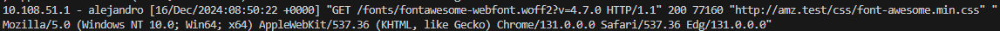

## Comprueba desde tu máquina física/anfitrión que puedes acceder a `http://nombre-sitio-web` y que se te solicita autenticación.

##  Comprueba que si decides cancelar la autenticación, se te negará el acceso al sitio con un error. ¿Qué error es?

# T.1
## Intenta entrar primero con un usuario erróneo

Logs:
- `access.log`
Usuario erroneo:

Usuario correcto:

- `error.log`

# T.2
Borra las dos líneas que hacen referencia a la autenticación básica en el location del directorio raíz.
Tras ello, añade un nuevo location debajo con la autenticación básica para el archivo/sección
contact.html únicamente.

# T.3
## 3.1
Configura Nginx para que no deje acceder con la IP de la máquina anfitriona al directorio raíz de
una de tus dos webs. Modifica su server block o archivo de configuración. Comprueba como se
deniega el acceso:
- Muestra la página de error en el navegador

- Muestra el mensaje de error de error.log

## 3.2
Configura Nginx para que desde tu máquina anfitriona se tenga que tener tanto una IP válida como
un usuario válido, ambas cosas a la vez, y comprueba que sí puede acceder sin problemas

`access.log`
