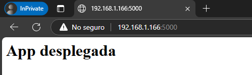

# FLASK y GUNICORN: Aplicaciones Python

<hr style="border-radius: 10px;">

## Comandos de Instalación

Estos comandos se utilizan para actualizar los paquetes del sistema e instalar Nginx, Python y Gunicorn en una máquina basada en Debian/Ubuntu:

1. **Actualizar la lista de paquetes:**
    ```sh
    apt-get update -y
    ```
    Este comando actualiza la lista de paquetes disponibles y sus versiones.

2. **Instalar Nginx y Python:**
    ```sh
    apt-get install -y nginx python3-pip git
    ```
    Este comando instala el servidor web Nginx, Python3 y Git.

3. **Instalar Pipenv y dependencias:**
    ```sh
    pip3 install pipenv python-dotenv
    pipenv --version
    ```
    Pipenv se usa para gestionar entornos virtuales y dependencias en Python.

## Configuración del Servidor

1. **Verificar el estado de Nginx:**
    ```sh
    systemctl status nginx
    ```
    Este comando muestra el estado del servidor web Nginx.

2. **Configurar el entorno de trabajo:**
    ```sh
    mkdir -p /var/www/app
    chown -R vagrant:www-data /var/www/app
    chmod -R 755 /var/www/app
    ```
    Esto configura los permisos adecuados para la carpeta de la aplicación.

3. **Copiar archivos de configuración:**
    ```sh
    cp /vagrant/config/.env /var/www/app
    cp /vagrant/config/amz /etc/nginx/sites-available/default
    cp /vagrant/config/application.py /var/www/app
    cp /vagrant/config/wsgi.py /var/www/app
    ```
    Se copian los archivos necesarios desde la carpeta compartida de Vagrant.

### Comprobaciones

1. **Verificar la configuración de Nginx:**
    ```sh
    nginx -t
    ```
    Este comando verifica si la configuración de Nginx es válida.

2. **Reiniciar Nginx:**
    ```sh
    systemctl restart nginx
    ```
    Reinicia el servidor Nginx para aplicar los cambios.

## Despliegue con Flask y Gunicorn

### Instalación de Flask y Gunicorn

1. **Instalar Flask y Gunicorn en el entorno virtual:**
    ```sh
    cd /var/www/app
    pipenv install flask gunicorn
    ```
    Se instalan las dependencias necesarias dentro del entorno virtual.

2. **Ejecutar la aplicación con Gunicorn:**
    ```sh
    pipenv run gunicorn -w 4 -b 0.0.0.0:8000 wsgi:app
    ```
    Se inicia Gunicorn con 4 trabajadores y en el puerto 8000.

### Configuración del Servicio

1. **Crear un servicio systemd para Gunicorn:**
    ```sh
    nano /etc/systemd/system/gunicorn.service
    ```
    Dentro del archivo, añadir:
    ```ini
    [Unit]
    Description=flask app service - App con flask y Gunicorn
    After=network.target
    [Service]
    User=vagrant
    Group=www-data
    Environment="PATH=/home/vagrant/.local/share/virtualenvs/app-1lvW3LzD/bin"
    WorkingDirectory=/var/www/app
    ExecStart=/home/vagrant/.local/share/virtualenvs/app-1lvW3LzD/bin/gunicorn --workers 3 --bind unix:/var/www/app/app.sock wsgi:app

    [Install]
    WantedBy=multi-user.target
    ```

2. **Activar y ejecutar el servicio:**
    ```sh
    systemctl daemon-reload
    systemctl start gunicorn
    systemctl enable gunicorn
    ```
    Esto garantiza que Gunicorn se ejecute automáticamente en el arranque.

### Configuración de Proxy con Nginx

1. **Editar la configuración de Nginx:**
    ```sh
    nano /etc/nginx/sites-available/default
    ```
    Reemplazar el contenido con:
    ```nginx
    server {
        listen 80;
        server_name app.izv www.app.izv;

        access_log /var/log/nginx/app.access.log;
        error_log /var/log/nginx/app.error.log;

        location / {
            include proxy_params;
            proxy_pass http://unix:/var/www/app/app.sock;
        }
    }
    ```

2. **Reiniciar Nginx para aplicar cambios:**
    ```sh
    systemctl restart nginx
    ```

### Comprobaciones

1. **Verificar el funcionamiento**
    Acceder a `http://<ip-mv>:5000` en el navegador.
    

2. **Verificar que Gunicorn está en ejecución:**
    ```sh
    systemctl status gunicorn
    ```
    Se debería ver un mensaje indicando que el servicio está activo.

# Práctica de amplicación

<hr style="border-radius: 10px;">

1. **Clonar el repositorio:**
    ```sh
    cd /var/www/
    sudo git clone https://github.com/Azure-Samples/msdocs-python-flask-webapp-quickstart
    sudo chown -R vagrant:vagrant /var/www/msdocs-python-flask-webapp-quickstart
    ```
    Esto clona el repositorio y cambia la propiedad de los archivos para evitar problemas de permisos.

2. **Instalar dependencias:**
    ```sh
    cd /var/www/msdocs-python-flask-webapp-quickstart
    pipenv install -r requirements.txt
    ```
    Se instalan las dependencias listadas en el archivo `requirements.txt`.

3. **Crear el entorno virtual con Pipenv:**
    ```sh
    pipenv --python 3.9
    pipenv install flask gunicorn
    ```
    Esto crea un entorno virtual con Python 3.9 e instala `Flask` y `Gunicorn`.

4. **Configurar variables de entorno para Flask y Gunicorn:**
    Esto paso es por si queremos ejecutar `Flask` o `Gunicorn` con variables de entorno dentro del entorno virtual.
    ```sh
    echo 'export FLASK_APP=application.py' >> ~/.bashrc
    echo 'export FLASK_ENV=production' >> ~/.bashrc
    source ~/.bashrc
    ```
    Se establecen las variables de entorno necesarias para Flask.

5. **Ejecutar la aplicación con Gunicorn:**
    Entraremos dentro del entorno virtual con `pipenv shell` y luego ejecutaremos el siguiente comando:
    ```sh
    gunicorn --workers 4 --bind 0.0.0.0:5000 app:app
    ```
    Se inicia Gunicorn con 4 trabajadores y en el puerto 5000.

### Comprobaciones
