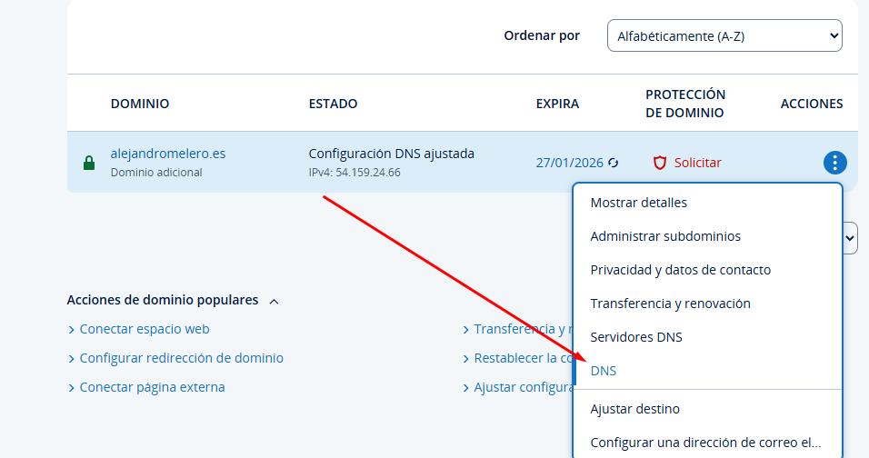
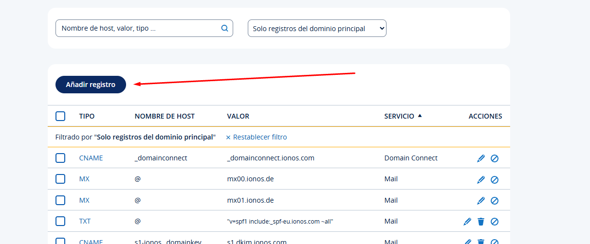
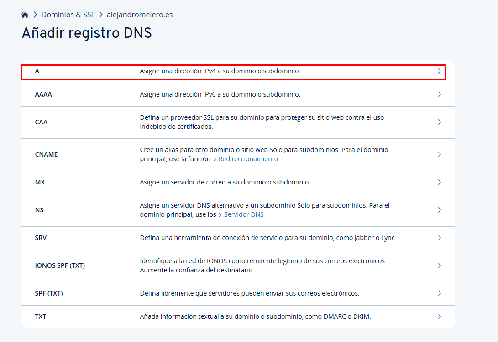
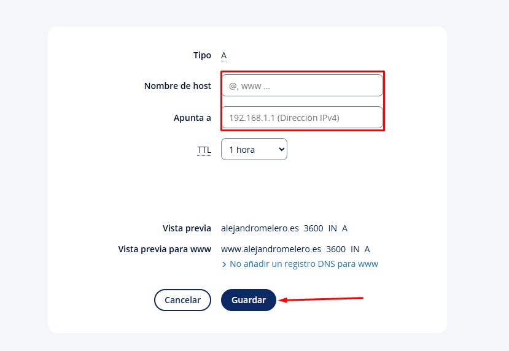
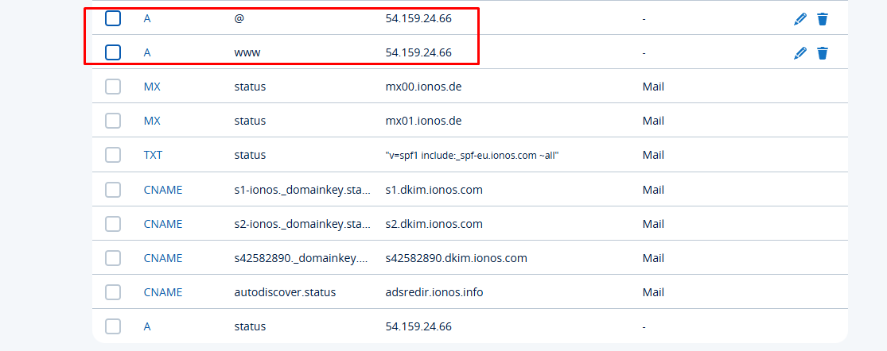
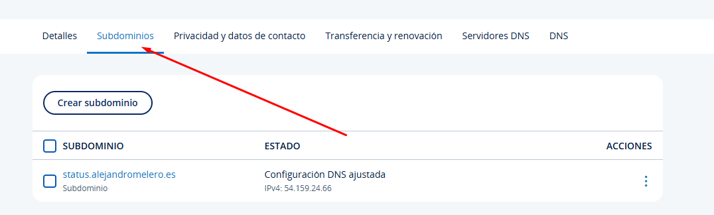
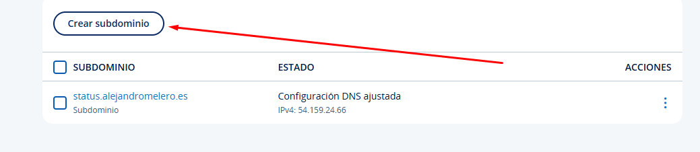
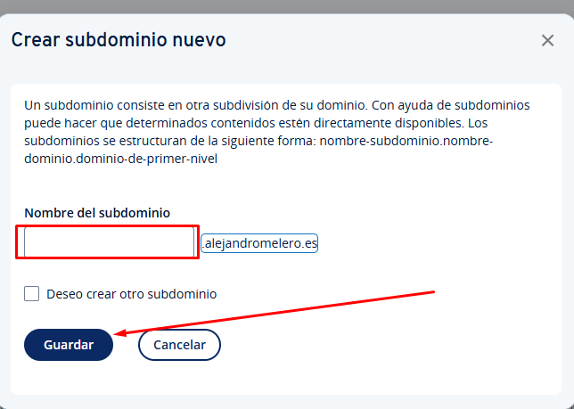

# Instación y configuración de Apache con Uptime-Kuma
---
## 1. Instación de paquetes y configuración
Primero ejecutaremos los siguientes comandos para poder realizar el proyecto
```
sudo apt-get update -y                  # Actualiza la lista de paquetes disponibles y sus versiones.
sudo apt-get install apache2 -y        # Instala el servidor web Apache2.
sudo apt-get install curl -y           # Instala cURL, una herramienta para realizar solicitudes HTTP.
sudo apt-get install git -y            # Instala Git, un sistema de control de versiones.
sudo apt-get install git curl -y       # Instala simultáneamente Git y CURL.
sudo curl -sL https://deb.nodesource.com/setup_current.x | sudo bash - 
                                        # Descarga e instala el repositorio de Node.js.
sudo apt-get install nodejs -y         # Instala Node.js y npm (Node Package Manager).
sudo apt-get upgrade -y                # Actualiza todos los paquetes instalados a sus últimas versiones.

sudo a2enmod proxy                     # Habilita el módulo de proxy en Apache2.
sudo a2enmod proxy_http                # Habilita el módulo de proxy para HTTP en Apache2.
sudo a2enmod auth_basic                # Habilita el módulo de autenticación básica en Apache2.
sudo nano /etc/apache2/sites-available/000-default.conf 
                                        # Abre el archivo de configuración predeterminado de Apache2 para editarlo.

# Bloque de código de 000-default.conf:
# Este bloque define configuraciones específicas para el sitio, como redirecciones, proxies o autenticación.

sudo cp -r config/web/* /var/www/html/ # Copia todos los archivos del directorio "config/web" al directorio raíz de Apache2.
sudo chmod -R 755 /var/www/html/       # Cambia los permisos del directorio raíz de Apache2 para que sean accesibles.
sudo apt install apache2-utils -y     # Instala herramientas adicionales para Apache2, como htpasswd.
sudo nano /etc/apache2/.htpasswdAdministration 
                                        # Abre o crea el archivo de contraseñas para administración en Apache2.

# Bloque de .htpasswdAdministration:
# Contiene usuarios y contraseñas encriptadas para la autenticación básica.

sudo nano /etc/apache2/.htpasswdStatus 
                                        # Abre o crea un archivo para la autenticación de estado en Apache2.

sudo systemctl restart apache2         # Reinicia el servicio de Apache2 para aplicar cambios.
sudo systemctl status apache2          # Muestra el estado actual del servicio de Apache2.

git clone https://github.com/louislam/uptime-kuma.git
                                        # Clona el repositorio de Uptime Kuma en el directorio actual.
cd uptime-kuma                         # Cambia al directorio del proyecto clonado.
sudo npm run setup                     # Ejecuta el script de configuración de Uptime Kuma.
sudo node server/server.js             # Inicia el servidor de Uptime Kuma.
```
### 000-default.conf
```
<VirtualHost *:443>
    # The ServerName directive sets the request scheme, hostname and port that
    # the server uses to identify itself. This is used when creating
    # redirection URLs. In the context of virtual hosts, the ServerName
    # specifies what hostname must appear in the request's Host: header to
    # match this virtual host. For the default virtual host (this file) this
    # value is not decisive as it is used as a last resort host regardless.
    # However, you must set it for any further virtual host explicitly.
    ServerName alejandromelero.es

    ServerAdmin webmaster@localhost
    DocumentRoot /var/www/html

    # Available loglevels: trace8, ..., trace1, debug, info, notice, warn,
    # error, crit, alert, emerg.
    # It is also possible to configure the loglevel for particular
    # modules, e.g.
    #LogLevel info ssl:warn

    ErrorLog ${APACHE_LOG_DIR}/error.log
    CustomLog ${APACHE_LOG_DIR}/access.log combined
    ErrorDocument 404 /html/404.html

    <Directory "/var/www/html/admin">
        AuthType Basic
        AuthName "Restricted Access"
        AuthUserFile /etc/apache2/.htpasswdAdministration
        Require valid-user
    </Directory>

    <Location /status>
        AuthType Basic
        AuthName "Restricted Access"
        AuthUserFile /etc/apache2/.htpasswdStatus
        Require valid-user

        Redirect permanent /status https://status.alejandromelero.es
    </Location>

    # For most configuration files from conf-available/, which are
    # enabled or disabled at a global level, it is possible to
    # include a line for only one particular virtual host. For example the
    # following line enables the CGI configuration for this host only
    # after it has been globally disabled with "a2disconf".
    #Include conf-available/serve-cgi-bin.conf
    RewriteEngine on
    RewriteCond %{SERVER_NAME} =alejandromelero.es
    RewriteRule ^ https://%{SERVER_NAME}%{REQUEST_URI} [END,NE,R=permanent]
</VirtualHost>

# vim: syntax=apache ts=4 sw=4 sts=4 sr noet

<VirtualHost *:443>
    ServerName status.alejandromelero.es
    ProxyPreserveHost On
    ProxyPass / http://localhost:3001/
    ProxyPassReverse / http://localhost:3001/
    <Proxy *>
        Order deny,allow
        Allow from all
    </Proxy>
    RewriteEngine on
    RewriteCond %{SERVER_NAME} =status.alejandromelero.es
    RewriteRule ^ https://%{SERVER_NAME}%{REQUEST_URI} [END,NE,R=permanent]
</VirtualHost>
```

### .htpasswdStatus
`sysadmin:$apr1$KQws7SWB$3qNMtc4ElI9Lto2AYZobx.`

### .htpasswdAdministration
`admin:$apr1$5X8qtVp1$duuNiU39zl22Y26rH.AuK/`

## 2. Configuración el dominio y subdominios en IONOS
Nos iremos a https://my.ionos.es/domains y nos logearemos con nuestras credenciales.

### 2.1 Crear un registro de tipo A
1. Accederemos a DNS

2. Crear el registro

3. Seleccionar el tipo de registro

4. Rellenar los campos y darle al botón de guardar

Resultado:


### 2.2 Crear el subdominio
1. Accederemos a subdominios

2. Le daremos a "Crear subdominio"

3. Rellenar los campos y darle a "Guardar"



# Configuración de la API de IONOS en el servidor
### Instalar Python
1. Para instalar Python 3.x, introduzca los siguientes comandos.

```
sudo apt-get update
sudo apt-get upgrade
sudo apt-get install software-properties-common sudo
sudo apt-get install python3
```
### Instalar Python
2. Instalar pip, introduzca el siguiente comando:

    ```sudo apt install python3-pip```
    <br>
3. Crear un entorno virtual
```
sudo apt install python3-venv
python3 -m venv myenv
source myenv/bin/activate
```
4. Instalar el cliente multiplataforma
Para instalar el cliente multiplataforma, introduzca el siguiente comando:
```sudo pip install domain-connect-dyndns```
    <br>
5. Para añadir el dominio cuya configuración de DNS debe actualizarse automáticamente, escriba el siguiente comando:
```domain-connect-dyndns setup --domain NOMBRE_DEL_DOMINIO```
    <br>

    Ejemplo:

    ```domain-connect-dyndns setup --domain example.com```
    <br>

6. Copie la URL y péguela en su navegador.

7. Inicie sesión en área IONOS.

8. Haga clic en Permitir.

9. Anote el código que se muestra.

10. Abra la línea de comandos e introduzca el código.

11. Para actualizar todos los dominios, escriba el siguiente comando:

```domain-connect-dyndns update --all```

Después de introducir el comando, puede aparecer el siguiente mensaje:

```
[root@localhost ~]# domain-connect-dyndns update --all Read
example.com config. IP
217.160.25.20 found in A record New
IP: 217.160.25.20 A
record up to date
```

12. Para que la dirección IP se actualice regularmente en el registro DNS, se debe configurar una tarea Cron. Para editar el archivo crontab, escriba el siguiente comando:

```crontab -e```