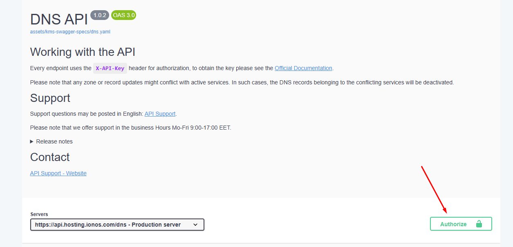
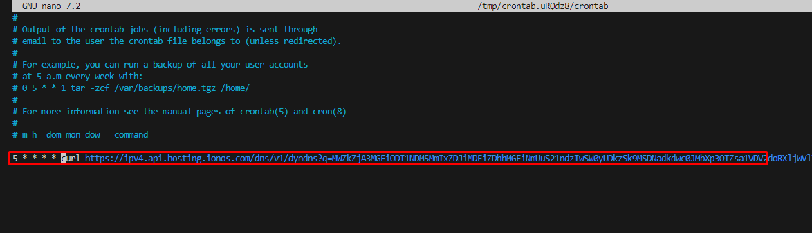
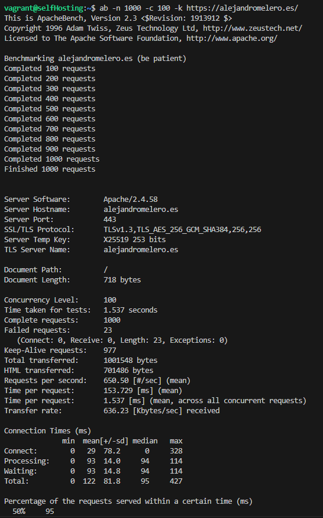
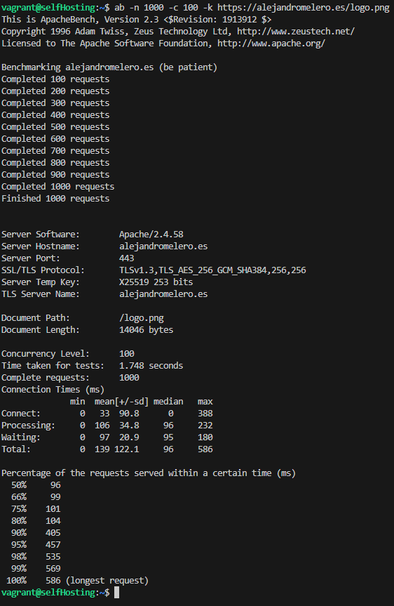
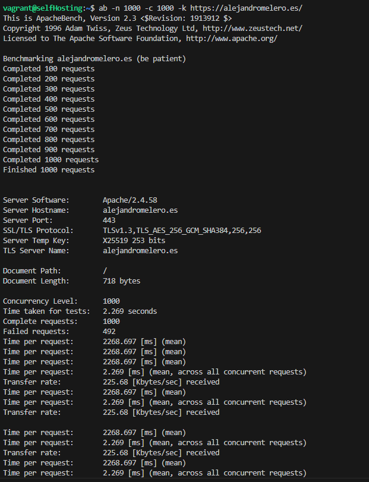
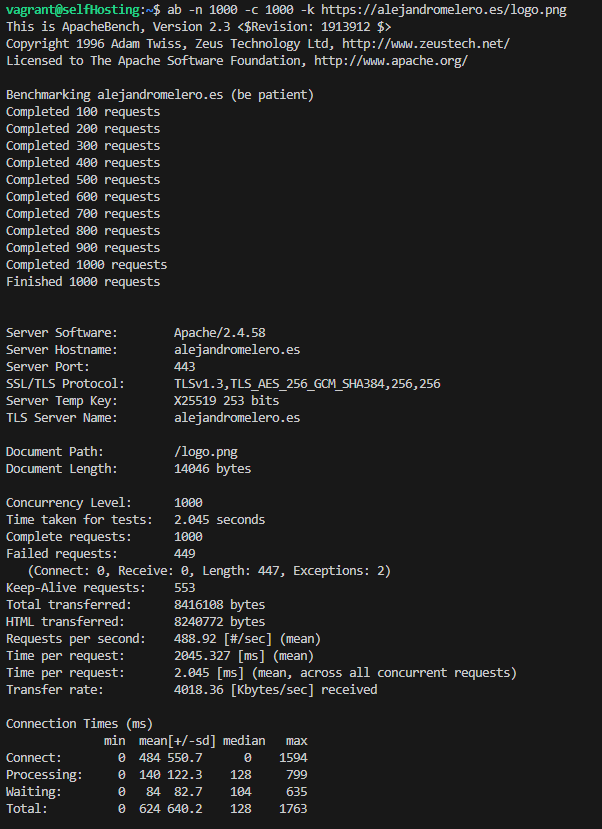
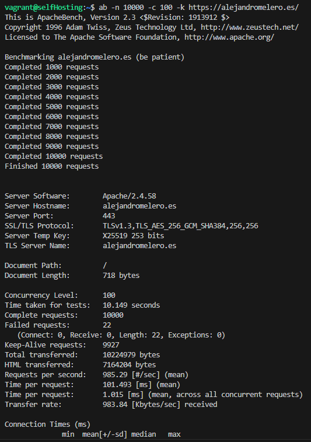
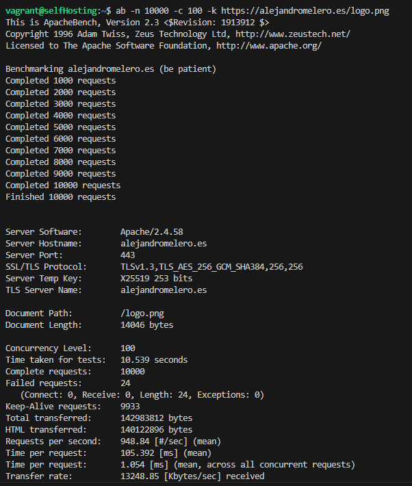
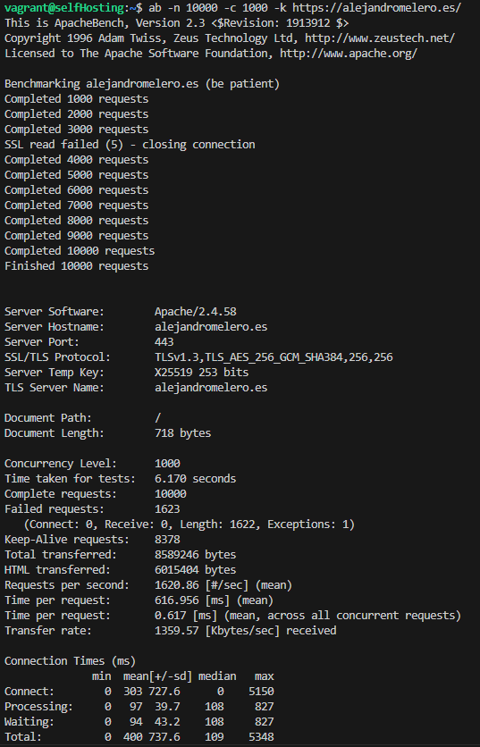
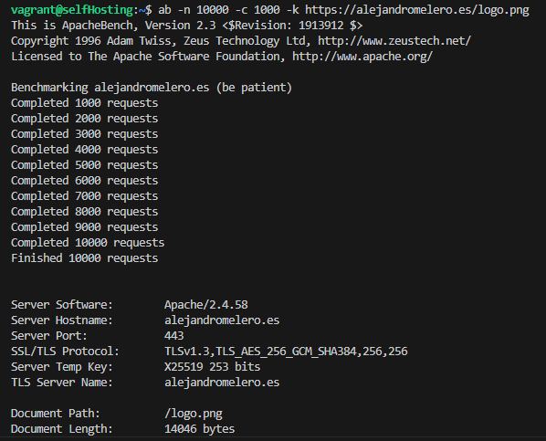

# Instación y configuración de Apache con Uptime-Kuma
---
## 1. Instación de paquetes y configuración
Primero ejecutaremos los siguientes comandos para poder realizar el proyecto
```
sudo apt-get update -y                  # Actualiza la lista de paquetes disponibles y sus versiones.
sudo apt-get install apache2 -y        # Instala el servidor web Apache2.
sudo apt-get install curl -y           # Instala cURL, una herramienta para realizar solicitudes HTTP.
sudo apt-get install git -y            # Instala Git, un sistema de control de versiones.
sudo apt-get install git curl -y       # Instala simultáneamente Git y CURL.
sudo curl -sL https://deb.nodesource.com/setup_current.x | sudo bash - 
                                        # Descarga e instala el repositorio de Node.js.
sudo apt-get install nodejs -y         # Instala Node.js y npm (Node Package Manager).
sudo apt-get upgrade -y                # Actualiza todos los paquetes instalados a sus últimas versiones.

sudo a2enmod proxy                     # Habilita el módulo de proxy en Apache2.
sudo a2enmod proxy_http                # Habilita el módulo de proxy para HTTP en Apache2.
sudo a2enmod auth_basic                # Habilita el módulo de autenticación básica en Apache2.
sudo nano /etc/apache2/sites-available/000-default.conf 
                                        # Abre el archivo de configuración predeterminado de Apache2 para editarlo.

# Bloque de código de 000-default.conf:
# Este bloque define configuraciones específicas para el sitio, como redirecciones, proxies o autenticación.

sudo cp -r config/web/* /var/www/html/ # Copia todos los archivos del directorio "config/web" al directorio raíz de Apache2.
sudo chmod -R 755 /var/www/html/       # Cambia los permisos del directorio raíz de Apache2 para que sean accesibles.
sudo apt install apache2-utils -y     # Instala herramientas adicionales para Apache2, como htpasswd.
sudo nano /etc/apache2/.htpasswdAdministration 
                                        # Abre o crea el archivo de contraseñas para administración en Apache2.

# Bloque de .htpasswdAdministration:
# Contiene usuarios y contraseñas encriptadas para la autenticación básica.

sudo nano /etc/apache2/.htpasswdStatus 
                                        # Abre o crea un archivo para la autenticación de estado en Apache2.

sudo systemctl restart apache2         # Reinicia el servicio de Apache2 para aplicar cambios.
sudo systemctl status apache2          # Muestra el estado actual del servicio de Apache2.

git clone https://github.com/louislam/uptime-kuma.git
                                        # Clona el repositorio de Uptime Kuma en el directorio actual.
cd uptime-kuma                         # Cambia al directorio del proyecto clonado.
sudo npm run setup                     # Ejecuta el script de configuración de Uptime Kuma.
sudo node server/server.js             # Inicia el servidor de Uptime Kuma.
```
### 000-default.conf
```
<VirtualHost *:443>
    # The ServerName directive sets the request scheme, hostname and port that
    # the server uses to identify itself. This is used when creating
    # redirection URLs. In the context of virtual hosts, the ServerName
    # specifies what hostname must appear in the request's Host: header to
    # match this virtual host. For the default virtual host (this file) this
    # value is not decisive as it is used as a last resort host regardless.
    # However, you must set it for any further virtual host explicitly.
    ServerName alejandromelero.es

    ServerAdmin webmaster@localhost
    DocumentRoot /var/www/html

    # Available loglevels: trace8, ..., trace1, debug, info, notice, warn,
    # error, crit, alert, emerg.
    # It is also possible to configure the loglevel for particular
    # modules, e.g.
    #LogLevel info ssl:warn

    ErrorLog ${APACHE_LOG_DIR}/error.log
    CustomLog ${APACHE_LOG_DIR}/access.log combined
    ErrorDocument 404 /html/404.html

    <Directory "/var/www/html/admin">
        AuthType Basic
        AuthName "Restricted Access"
        AuthUserFile /etc/apache2/.htpasswdAdministration
        Require valid-user
    </Directory>

    <Location /status>
        AuthType Basic
        AuthName "Restricted Access"
        AuthUserFile /etc/apache2/.htpasswdStatus
        Require valid-user

        Redirect permanent /status https://status.alejandromelero.es
    </Location>

    # For most configuration files from conf-available/, which are
    # enabled or disabled at a global level, it is possible to
    # include a line for only one particular virtual host. For example the
    # following line enables the CGI configuration for this host only
    # after it has been globally disabled with "a2disconf".
    #Include conf-available/serve-cgi-bin.conf
    RewriteEngine on
    RewriteCond %{SERVER_NAME} =alejandromelero.es
    RewriteRule ^ https://%{SERVER_NAME}%{REQUEST_URI} [END,NE,R=permanent]
</VirtualHost>

# vim: syntax=apache ts=4 sw=4 sts=4 sr noet

<VirtualHost *:443>
    ServerName status.alejandromelero.es
    ProxyPreserveHost On
    ProxyPass / http://localhost:3001/
    ProxyPassReverse / http://localhost:3001/
    <Proxy *>
        Order deny,allow
        Allow from all
    </Proxy>
    RewriteEngine on
    RewriteCond %{SERVER_NAME} =status.alejandromelero.es
    RewriteRule ^ https://%{SERVER_NAME}%{REQUEST_URI} [END,NE,R=permanent]
</VirtualHost>
```

### .htpasswdStatus
`sysadmin:$apr1$KQws7SWB$3qNMtc4ElI9Lto2AYZobx.`

### .htpasswdAdministration
`admin:$apr1$5X8qtVp1$duuNiU39zl22Y26rH.AuK/`

## 2. Configuración el dominio y subdominios en IONOS
Nos iremos a https://my.ionos.es/domains y nos logearemos con nuestras credenciales.

### 2.1 Crear un registro de tipo A
1. Accederemos a DNS


2. Crear el registro


3. Seleccionar el tipo de registro


4. Rellenar los campos y darle al botón de guardar


Resultado:


### 2.2 Crear el subdominio
1. Accederemos a subdominios


2. Le daremos a "Crear subdominio"


3. Rellenar los campos y darle a "Guardar"


# Configuración de la API de IONOS en el servidor
1. Crearemo una API-Key y luego probaremos a hacer un curl para ver que todo funcione bien concantenando en en el parámetro de `--header` el prefijo y el sufijo.

```curl -X GET https://api.hosting.ionos.com/dns/v1/zones \ -H "X-API-Key: cfc9240805.cbx1K2HT9OhPVZGnavYlMsJIrCdut6Dg"```
<br>

2. Activaremos autorizaremos la API de DNS de IONOS en el siguiente enlace https://developer.hosting.ionos.es/docs/dns



<br>
3. Luego lanzaremos un automatización de DNS y copiaremos el enlace que este nos proporciona.

```
curl -X 'POST' \
  'https://api.hosting.ionos.com/dns/v1/dyndns' \
  -H 'accept: application/json' \
  -H 'X-API-Key: cfc9240805.cbx1K2HT9OhPVZGnavYlMsJIrCdut6Dg' \ 
  -H 'Content-Type: application/json' \
  -d '{
  "domains": [
    "example.com", 
    "www.example.com" 
  ],
  "description": "DNS dinámico"
 }'
```

Nos devolvería lago como esto y nos quedariamos con la `updateUrl`:
```
{

    "bulkId": "22af3414-abbe-9e11-5df5-66fbe8e334b4",
    "updateUrl": "https://ipv4.api.hosting.ionos.com/dns/v1/dyndns?q=dGVzdC50ZXN0", ①
    "domains": [
    "example-zone.de",
    "www.example-zone.de"
    ],
    "description": "My DynamicDns"
}
```
12. Para que la dirección IP se actualice regularmente en el registro DNS, se debe configurar una tarea Cron. Para editar el archivo crontab, escriba el siguiente comando:

```crontab -e```

13. Y dentro de este pondremos el siguiente contenido:

```5 * * * * curl {URL-PROPORCIONADA-POR-IONOS-EN-EL-PASO-ANTERIOR}```

```crontab -e```

Crearemos la tarea programada



# 3. Ejecución de pruebas de rendimiento
## Prueba 1: 100 usuarios concurrentes y 1000 peticiones
### Página principal con SSL/TLS
`ab -n 1000 -c 100 -k https://alejandromelero.es/`


### Recurso específico (logo.png)
`ab -n 1000 -c 100 -k https://alejandromelero.es/logo.png`




## Prueba 2: 1000 usuarios concurrentes y 1000 peticiones
### Página principal con SSL/TLS
`ab -n 1000 -c 1000 -k https://alejandromelero.es/`


### Recurso específico (logo.png)
`ab -n 1000 -c 1000 -k https://alejandromelero.es/logo.png`



## Prueba 3: 100 usuarios concurrentes y 10,000 peticiones
### Página principal con SSL/TLS
`ab -n 10000 -c 100 -k https://alejandromelero.es/`


### Recurso específico (logo.png)
`ab -n 10000 -c 100 -k https://alejandromelero.es/logo.png`




# Prueba 4: 1000 usuarios concurrentes y 10,000 peticiones
### Página principal con SSL/TLS
`ab -n 10000 -c 1000 -k https://alejandromelero.es/`


### Recurso específico (logo.png)
`ab -n 10000 -c 1000 -k https://alejandromelero.es/logo.png`



# 4. Pruebas de que funciona

