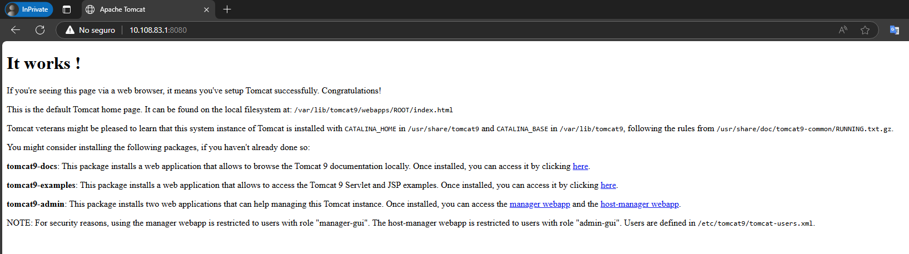
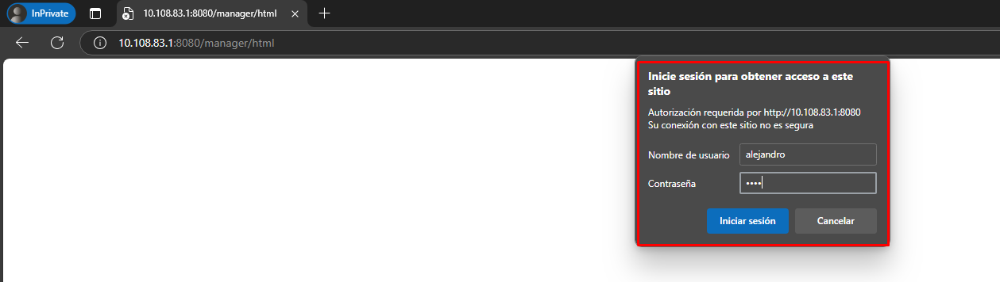
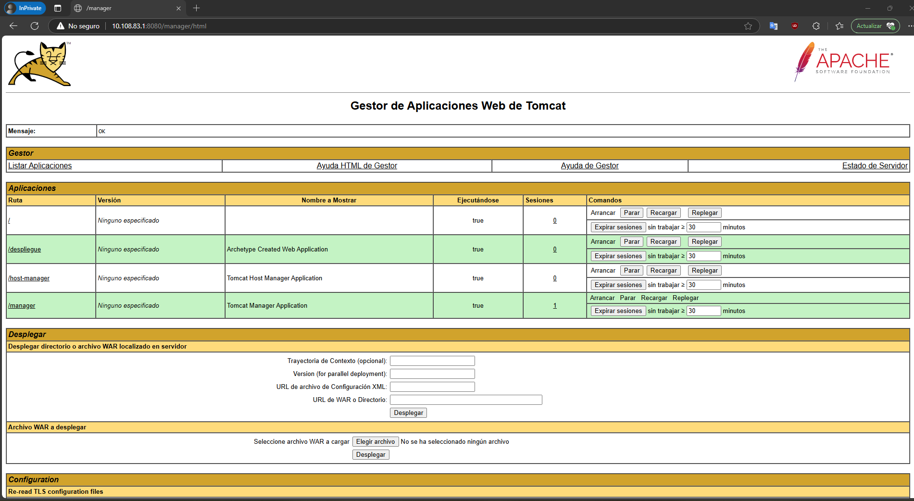
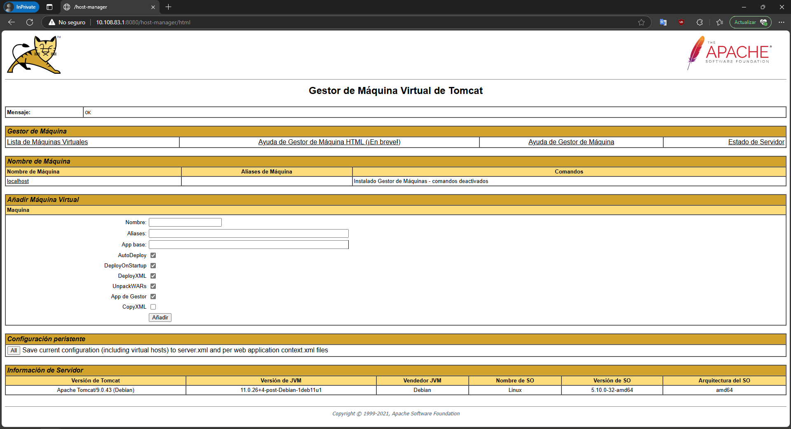
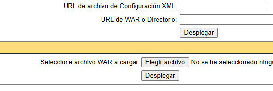
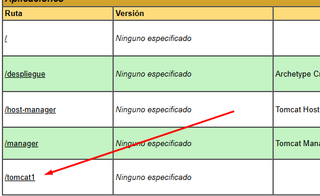
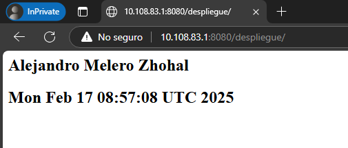

# Tomcat y Maven: Aplicaciones Java

<hr style="border-radius: 10px;">

## Comandos de Instalación

Estos comandos se utilizan para actualizar los paquetes del sistema e instalar Java, Tomcat y Maven en una máquina basada en Debian/Ubuntu:

1. **Actualizar la lista de paquetes:**
    ```sh
    apt-get update -y
    ```
    Este comando actualiza la lista de paquetes disponibles y sus versiones, pero no instala ni actualiza ningún paquete.

2. **Instalar OpenJDK 11:**
    ```sh
    apt install -y openjdk-11-jdk
    ```
    Este comando instala el kit de desarrollo de Java (JDK) versión 11, que es necesario para ejecutar aplicaciones Java.

3. **Instalar Tomcat 9:**
    ```sh
    apt install -y tomcat9
    ```
    Este comando instala Apache Tomcat versión 9, un servidor de aplicaciones utilizado para desplegar aplicaciones web Java.

## Configuración de Tomcat

1. **Crear el grupo de usuarios para Tomcat:**
    ```sh
    groupadd tomcat9
    ```
    Este comando crea un grupo de usuarios llamado `tomcat9`.

2. **Crear el usuario para el servicio Tomcat:**
    ```sh
    useradd -s /bin/false -g tomcat9 -d /etc/tomcat9 tomcat9
    ```
    Este comando crea un usuario llamado `tomcat9` con características específicas para su uso como cuenta de servicio en el sistema.

3. **Iniciar el servicio Tomcat:**
    ```sh
    systemctl start tomcat9
    ```
    Este comando inicia el servicio Tomcat.

4. **Verificar el estado del servicio Tomcat:**
    ```sh
    systemctl status tomcat9
    ```
    Este comando muestra el estado del servicio Tomcat.

### Comprobaciones

1. **Verificar el funcionamiento**
    Verificaremos que los pasos realizados anteriormente funcionan accediendo a `http://localhost:8080`
    

## Acceso remoto
Tomcat no permite por defecto que se acceda a algunos paneles de control desde un ordenador distinto al `localhost`. Para solucionarlo sustituiremos el fichero `context.xml` del directorio `/usr/share/tomcat9-admin/host-manager/META-INF/` por el siguiente:
```XML
<?xml version="1.0" encoding="UTF-8"?>
<Context antiResourceLocking="false" privileged="true" >
  <CookieProcessor className="org.apache.tomcat.util.http.Rfc6265CookieProcessor"
                   sameSiteCookies="strict" />
  <Valve className="org.apache.catalina.valves.RemoteAddrValve"
         allow="\d+\.\d+\.\d+\.\d+" />
  <Manager sessionAttributeValueClassNameFilter="java\.lang\.(?:Boolean|Integer|Long|Number|String)|org\.apache\.catalina\.filters\.CsrfPreventionFilter\$LruCache(?:\$1)?|java\.util\.(?:Linked)?HashMap"/>
</Context>
```

```sh
sudo systemctl restart tomcat9
```

## Configuración de la administración

### Usuarios y permisos

Ahora es el momento de definir el usuario con acceso a Tomcat. Para ello, es necesario editar el archivo de configuración `/etc/tomcat9/tomcat-users.xml`.

1. **Editar el archivo de configuración de usuarios de Tomcat:**
    ```sh
    sudo nano /etc/tomcat9/tomcat-users.xml
    ```
    Este comando abre el archivo de configuración de usuarios de Tomcat en el editor de texto `nano`.

    Dentro de este archivo pondremos el siguiente contenido:
    ```xml
    <?xml version="1.0" encoding="UTF-8"?>
    <tomcat-users xmlns="http://tomcat.apache.org/xml"
                  xmlns:xsi="http://www.w3.org/2001/XMLSchema-instance"
                  xsi:schemaLocation="http://tomcat.apache.org/xml tomcat-users.xsd"
                  version="1.0">
        <role rolename="admin"/>
        <role rolename="admin-gui"/>
        <role rolename="manager"/>
        <role rolename="manager-gui"/>
        <user username="alumno"
              password="1234"
              roles="admin,admin-gui,manager,manager-gui"/>
    </tomcat-users>
    ```
    Este archivo configura un usuario llamado `alumno` con acceso completo a las funcionalidades administrativas y de gestión del servidor Tomcat, tanto en la interfaz gráfica como en las operaciones relacionadas con aplicaciones. Es una configuración típica para entornos de prueba o desarrollo.

2. **Instalar las herramientas de administración de Tomcat 9:**
    ```sh
    apt install -y tomcat9-admin
    ```
    Este comando instala las herramientas de administración de Tomcat, que incluyen la interfaz de administración web.

### Comprobaciones

1. **Verificar el funcionamiento**
    Verificaremos que los pasos realizados anteriormente funcionan accediendo a `http://localhost:8080/manager/html` con las credenciales ingresadas en el archivo `tomcat-users.xml`.
    
    

    Ahora accedamos a http://localhost:8080/host-manager/html para verificar el Administrador de host virtual Tomcat; escribe el nombre de usuario y la contraseña cuando te lo soliciten.
    

## Despliegue manual mediante GUI

Para ello:

1. **Nos logueamos con el usuario previamente creado:**
    Accedemos a `http://localhost:8080/manager/html` e ingresamos las credenciales del usuario `alumno` configurado en el archivo `tomcat-users.xml`.

2. **Descargamos el archivo `tomcat1.war` que acompaña a las prácticas:**
    Asegúrate de tener el archivo `tomcat1.war` disponible en tu máquina local.

3. **Buscamos la sección que nos permite desplegar un WAR manualmente:**
    En la interfaz de administración de Tomcat, buscamos la sección "Deploy" o "Despliegue" que permite cargar y desplegar archivos WAR manualmente. Seleccionamos el archivo `tomcat1.war` y lo subimos para desplegar la aplicación.
    
    

    

## Despliegue con Maven

### Instalación de Maven

1. **Instalar Maven:**
    ```sh
    sudo apt-get -y install maven
    ```
    Este comando instala Apache Maven, una herramienta de gestión y comprensión de proyectos Java.

2. **Configurar el archivo `tomcat-users.xml`:**
    Modificamos el archivo `/etc/tomcat9/tomcat-users.xml` acorde a nuestras necesidades (los nombres de usuario y contraseña deberán ser los que elijáis para vosotros):

    ```xml
    <role rolename="admin"/>
    <role rolename="admin-gui"/>
    <role rolename="manager"/>
    <role rolename="manager-gui"/>
    <role rolename="manager-status"/>
    <role rolename="manager-script"/>
    <role rolename="manager-jmx"/>
    <user username="alumno"
          password="1234"
          roles="admin, admin-gui, manager, manager-gui"/>
    <user username="deploy" password="1234" roles="manager-script"/>
    ```

3. **Configurar el archivo [settings.xml](http://_vscodecontentref_/0):**
    Edita el archivo `/etc/maven/settings.xml` para indicarle a Maven un identificador para el servidor sobre el que vamos a desplegar (no es más que un nombre, ponedle el nombre que consideréis), así como las credenciales. Todo esto se hará dentro del bloque `<servers>` del XML:

    ```xml
    <servers>
      <server>
        <id>Tomcat</id>
        <username>deploy</username>
        <password>1234</password>
      </server>
    </servers>
    ```

### Generar una aplicación

1. **Generar una aplicación de ejemplo en nuestro directorio personal:**
    ```sh
    cd
    ```

2. **Generar una aplicación de prueba:**
    ```sh
    mvn archetype:generate -DgroupId=org.zaidinvergeles \
                           -DartifactId=tomcat-war \
                           -DarchetypeArtifactId=maven-archetype-webapp \
                           -DinteractiveMode=false
    ```
    Podéis sustituir los valores de `groupId` y `artifactId` (este será el nombre de la aplicación) por lo que queráis.

    Tras muchas líneas veremos:
    ```sh
    [INFO] ------------------------------------------------------------------------
    [INFO] BUILD SUCCESS
    [INFO] ------------------------------------------------------------------------
    ```

3. **Entrar en el directorio de la aplicación generada:**
    ```sh
    cd tomcat-war
    ```

## Modificar el POM del proyecto

Ahora debemos modificar el POM del proyecto para que haga referencia a que el despliegue se realice con el plugin de Maven para Tomcat.

1. **Editar el archivo `pom.xml` del proyecto:**
    Asegúrate de que el archivo `pom.xml` contenga la siguiente configuración:

    ```xml
    <project xmlns="http://maven.apache.org/POM/4.0.0"
             xmlns:xsi="http://www.w3.org/2001/XMLSchema-instance"
             xsi:schemaLocation="http://maven.apache.org/POM/4.0.0 http://maven.apache.org/maven-v4_0_0.xsd">
        <modelVersion>4.0.0</modelVersion>
        <groupId>org.zaidinvergeles</groupId>
        <artifactId>tomcat-war-deployment</artifactId>
        <packaging>war</packaging>
        <version>1.0-SNAPSHOT</version>
        <name>tomcat-war-deployment Maven Webapp</name>
        <url>http://maven.apache.org</url>
        <dependencies>
            <dependency>
                <groupId>junit</groupId>
                <artifactId>junit</artifactId>
                <version>3.8.1</version>
                <scope>test</scope>
            </dependency>
        </dependencies>
        <build>
            <finalName>tomcat-war-deployment</finalName>
            <plugins>
                <plugin>
                    <groupId>org.apache.tomcat.maven</groupId>
                    <artifactId>tomcat7-maven-plugin</artifactId>
                    <version>2.2</version>
                    <configuration>
                        <url>http://localhost:8080/manager/text</url>
                        <server>Tomcat</server>
                        <path>/despliegue</path>
                    </configuration>
                </plugin>
            </plugins>
        </build>
    </project>
    ```

    Esta configuración en el archivo `pom.xml` asegura que el despliegue de la aplicación se realice utilizando el plugin `tomcat7-maven-plugin` de Maven, apuntando al servidor Tomcat en `http://localhost:8080/manager/text` con las credenciales configuradas previamente.
## Despliegue con Maven

### Desplegar una aplicación

Tras generar esta aplicación, los comandos finales que se utilizan en Maven para desplegar son:

1. **Desplegar una aplicación:**
    ```sh
    mvn tomcat7:deploy
    ```
    Este comando despliega la aplicación en el servidor Tomcat configurado.

2. **Volver a desplegar una aplicación:**
    ```sh
    mvn tomcat7:redeploy
    ```
    Este comando vuelve a desplegar la aplicación en el servidor Tomcat, útil para actualizar una aplicación ya desplegada.

3. **Retirar una aplicación desplegada:**
    ```sh
    mvn tomcat7:undeploy
    ```
    Este comando retira la aplicación desplegada del servidor Tomcat.

Así pues, tras el despliegue con Maven nos indicará que todo ha ido correctamente con un mensaje de `BUILD SUCCESS`, tal que así:

```sh
[INFO] Deploying war to http://localhost:8080/despliegue
Uploading: http://localhost:8080/manager/text/deploy?path=%2Fmyapp
Uploaded: http://localhost:8080/manager/text/deploy?path=%2Fmyapp (3 KB at 334.1 KB/sec)
```

### Comprobaciones

1. **Verificar el funcionamiento**
    Verificaremos que los pasos realizados anteriormente funcionan accediendo a `http://localhost:8080/despliegue` con las credenciales ingresadas en el archivo `tomcat-users.xml`.
