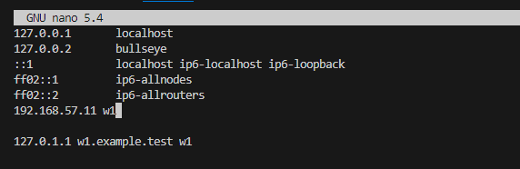
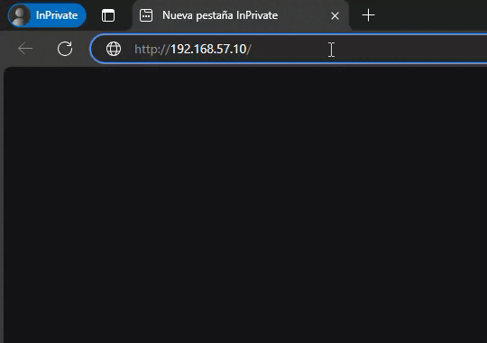
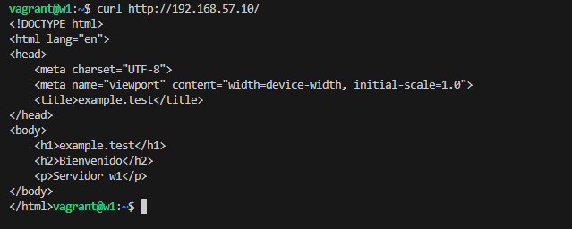
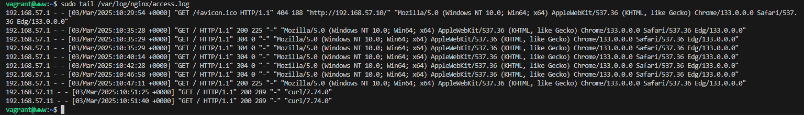
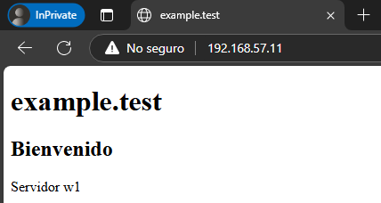
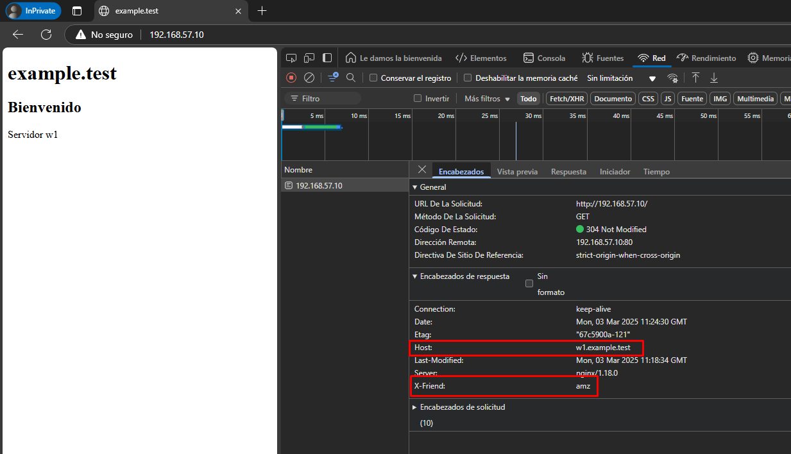

# Configuración de Proxy Inverso con Nginx en Debian

## Introducción
Este documento describe el proceso de configuración de un proxy inverso con Nginx en un entorno Debian. Se utilizarán dos servidores:
- **w1**: Servidor web que servira las páginas.
- **proxy**: Servidor que actuará como proxy inverso.

El acceso externo se realizará a través de **www.example.test (192.168.57.10)**, que redirigirá las solicitudes al servidor web original.

---
## Configuración de Vagrant
El siguiente **Vagrantfile** despliega el entorno:

```ruby
Vagrant.configure("2") do |config|
  config.vm.box = "debian/bullseye64"
  
  config.vm.provider "virtualbox" do |vb|
    vb.memory = "256"
  end
  
  config.vm.provision "shell", inline: <<-SHELL
    apt-get update && apt-get install -y nginx
  SHELL
  
  config.vm.define "proxy" do |proxy|
    proxy.vm.hostname = "www.example.test"
    proxy.vm.network "private_network", ip: "192.168.57.10"
  end
  
  config.vm.define "web" do |web|
    web.vm.hostname = "w1.example.test"
    web.vm.network "private_network", ip: "192.168.57.11"
  end  
end
```

---
## Configuración del Servidor Web (w1)

1. **Configurar Nginx**
    
    Editar el archivo de configuración de Nginx:
    ```sh
    sudo nano /etc/nginx/sites-available/default
    ```
    
    Incluir la siguiente configuración:
    ```nginx
    server {
        listen 8080;
        listen [::]:8080;

        server_name w1;
        root /var/www/html;
        index index.html index.htm;
        
        location / {
            add_header Host w1.example.test;
            try_files $uri $uri/ =404;
        }
    }
    ```
    
2. **Reiniciar Nginx para aplicar los cambios**
    ```sh
    sudo systemctl restart nginx
    ```
    
3. **Crear una página de prueba**
    ```sh
    sudo nano /var/www/html/index.html
    ```
    
    Agregar el siguiente contenido:
    ```html
    <!DOCTYPE html>
    <html lang="en">
    <head>
        <meta charset="UTF-8">
        <meta name="viewport" content="width=device-width, initial-scale=1.0">
        <title>example.test</title>
    </head>
    <body>
        <h1>example.test</h1>
        <h2>Bienvenido</h2>
        <p>Servidor w1</p>
    </body>
    </html>
    ```
    
4. **Probar el servidor**
    ```sh
    sudo apt install -y curl
    curl http://localhost:8080
    ```
---
## Configuración del Proxy Inverso

1. **Modificar el archivo hosts** en el servidor proxy para resolver el nombre de w1:
    ```sh
    sudo nano /etc/hosts
    ```
    
    Agregar la siguiente línea:
    ```
    192.168.57.11 w1
    ```
    

    
2. **Editar la configuración de Nginx en el proxy**
    ```sh
    sudo nano /etc/nginx/sites-available/default
    ```
    
    Agregar la siguiente configuración:
    ```nginx
    server {
        listen 80;
        listen [::]:80;

        server_name example.test www.example.test;

        location / {
            proxy_pass http://192.168.57.11:8080;
            add_header X-friend amz;
        }
    }
    ```
    
3. **Reiniciar Nginx para aplicar cambios**
    ```sh
    sudo systemctl restart nginx
    ```

---
## Comprobaciones

Para verificar que el proxy inverso está funcionando correctamente:

1. **Acceder desde el navegador**
    - Dirigirse a `http://192.168.57.10/`
    - Debería mostrarse la página web del servidor `w1`.
    

2. **Verificar conectividad con curl**
    ```sh
    curl http://192.168.57.10/
    ```
    

3. **Acceder a los logs del proxy**
    ```sh
    sudo tail /var/log/nginx/access.log
    ```
    

4. **Acceder a los logs de la web**
    ```sh
    sudo tail /var/log/nginx/access.log
    ```
    

5. **Comprobacion de la cabecera configurada en el proxy y el proxy**
    

## Ampliación
`compose.yml`